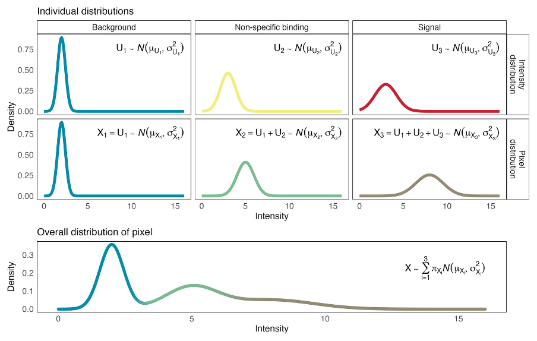

# bgnorm

## Overview

**bgnorm** is a Gaussian mixture model (GMM)-based method for background correction and normalization of spatial imaging data, particularly multiplexed spatial proteomics images. The package models intensity distributions using a three-component mixture model and performs marker- and pixel- or cell-level signal adjustment to remove technical background while preserving biological variation.

bgnorm provides tools for processing multi-channel imaging intensities and generating background-adjusted measurements suitable for downstream spatial and single-cell analyses.

### Theoretical Background

bgnorm assumes three types of pixels: - **Background** ($X_1 = U_1$): Only background signals - **Non-specific binding** ($X_2 = U_1 + U_2$): Background + non-specific binding - **Signal** ($X_3 = U_1 + U_2 + U_3$): Background + non-specific + true biological signal



bgnorm uses a statistical mixture model to separate these three signal types and estimate how likely each pixel is to contain real biological signal. For pixels that likely contain biological signal, bgnorm subtracts estimated background and non-specific contributions and rescales the remaining signal. Because each pixel is only probabilistically assigned to a signal type, bgnorm performs a soft correction rather than hard thresholding. This produces smooth, background-adjusted intensities at the pixel level, which can then be aggregated to cells for downstream spatial and single-cell analyses.

## Installation

Install the development version from GitHub, with either `pip` or `uv`:

**pip**

```bash
# latest on the default branch
pip install "git+https://github.com/BhuvaLab/bgnormPy.git"

# pin to a branch, tag, or commit
pip install "git+https://github.com/BhuvaLab/bgnormPy.git@main"
pip install "git+https://github.com/BhuvaLab/bgnormPy.git@v0.1.0"
```

**uv**

```bash
uv add "git+https://github.com/BhuvaLab/bgnormPy.git" 
uv add "git+https://github.com/BhuvaLab/bgnormPy.git" --tag v0.1.0
uv pip install "git+https://github.com/BhuvaLab/bgnormPy.git" # or into current env 
```

Or declare it via uv's git source in `pyproject.toml`:

```toml
[project]
dependencies = ["bgnorm"]

[tool.uv.sources]
bgnorm = { git = "https://github.com/BhuvaLab/bgnormPy.git", branch = "main" }
```

**Local / development** — install from a clone of this repo (assuming uv tooling):

```bash
git clone https://github.com/BhuvaLab/bgnormPy.git 
uv pip install -e . 
uv sync
```

### Requirements
- Python >= 3.12
- dask >= 2026.6.0
- dask-image >= 2026.5.0
- numpy >= 2.0
- pandas >= 3.0.3
- pydantic >= 2.13.4
- pyyaml >= 6.0
- scikit-learn >= 1.9.0
- scipy >= 1.17.1
- xarray >= 2026.4.0

## Quick Start

### Processing Pipeline

#### GMM Normalization Pipeline:

1.  **Read & Filter**: Load intensity data and apply median filtering
2.  **Log Transform**: Apply log2(x / cofactor + 1) transformation
3.  **Fit GMM**: Fit 3-component Gaussian mixture model to identify:
    -   Component 1: Background pixels
    -   Component 2: Non-specific binding pixels
    -   Component 3: Signal pixels
4.  **Classify**: Assign each pixel to a mixture component
5.  **Adjust**: Apply variance-weighted deconvolution to remove background from singal
6.  **Normalize**: Apply quantile normalization for cross-sample comparability
7.  **Aggregate**: Compute per-cell median intensities

### High-Level Workflow

The easiest way to run a complete workflow with a single function entrypoint:

- Files: Currently supports .png, .tif, .tiff, .qptiff out of the box.
- Matrix Data Structures: Numpy arrays, Xarray.DataArrays (recommended to validate with bgnorm.io.ImageSchema.validate)
- scverse Data Structures: SpatialData.images (Image2DModels; TBA)

```python
from bgnorm import bgnorm

merged, summaries = bgnorm(
    "./my_image.png" # filepath to image / matrix
    channel_name="my_channel_1", # if png or tiff with no channel metadata, can label it here
    #channel_names=["my_channel_1", "my_channel_2"], # if tiff with multiple channels, parse here instead
    
    # bgnorm parameters; below are the defaults
    median_filter_radius=3, # 3x3 square median filter
    image_cofactor=150, # used when computing log transform; log(x / cofactor)
    n_components=3, # core bgnorm assumption is to have thi to 3, do not change
    n_pixels_to_sample=1e5, # number of pixels used for fitting GMM
    pixel_sampling_seed=3,
    quantile_post_hoc_value=0.75, # if non-zero, adds the posthocquantile tranfsorm (bgnormQ) at this quantile
    compute_bic_model_order=False, # computes GMMs at k=1, .., n_components to compute fitness
)
```

`merged` returns an xr.Dataset with
.adjusted_image (c, y, x) -> bgnormed image
.adjusted_image_post_hoc (c, y, x) -> bgnormedQ image with posthoc quantile transform
.labels (c, y, x) -> the component assignments of every pixel for each channel
.probs (c, c_probs, y, x) -> the prediction probability of each component in each pixel, for each channel

`summaries` returns a pd.DataFrame with model parametrs and statistics (columns), for each channel (rows)

### Advanced Usage
#### Custom Image Data Structures
If using your own image data structures, we recommend parsing it to a richly annotated xr.DataArray, with coords `c` for channel dim, etc. You can validate its compatibility with bgnorm by using our pydantic Image schema:
```python
from bgnorm.io import ImageLikeSchema

img = ... # xarray.DataArray
img_validated = ImageLikeSchema.validate(img)
```

#### Scikit-Learn Composition
BgNorm steps exist as scikit-learn compatible modules and can be used to compose the bgnorm function as a scikit-learn Pipeline. We recommend using the `BgNormConfig` schema to validate parameters:

```python
from bgnorm import (
    BgNormConfig,
    MedianFilter,
    Log2Transform,
    BgNormChannel,
    PostHocQuantile
)
from sklearn.pipeline import Pipeline

cfg = BgNormConfig(
    median_filter_radius=3,
    image_cofactor=150,
    n_components=3,
    n_pixels_to_sample=1e5,
    pixel_sampling_seed=42,
    quantile_post_hoc_value=0.75
)

steps = [
    ("median_filter", MedianFilter(cfg.median_filter_radius)),
    ("log2_transform", Log2Transform(cfg.image_cofactor)),
    ("bgnorm", BgNormChannel(
        cfg.n_components, 
        cfg.n_pixels_to_sample, 
        cfg.pixel_sampling_seed
        )
    ),
    ("post_hoc_quantile", PostHocQuantile(cfg.quantile_post_hoc_value))
]

pp = Pipeline(steps)
adjusted_image = pp.fit_transform(...)
```

#### MLFlow Experiment Tracking
BgnormPy supports rich MLFlow integration to track bgnorm runs as experiements to explore the results in a rich UI. The base image is treated as one 'experiment', where each run is a bgnorm call with the given set of parameters. Since each image channel is bgnormed indepdenntly, these are organised as 'subruns'.

```python
# To track experiments, provide a TrackingConfig object to the main function
from bgnorm import bgnorm, TrackingConfig

merged, summaries = bgnorm(
    image,
    channel_dim="c",
    tracking=TrackingConfig(
        tracking_uri=None, # or URI to your mlflow server. If none, this will create a local sqlite db as per your MLFlow version
        image_name="my_image_label" # this will be the base name of your experiment, prepended with '/bgnorm'
    ),
    # and your bgnorm params below
    n_pixels_to_sample=1e5,
    ...
)
```

## Citation
If you use bgnormPy in your research, please cite: TBA
